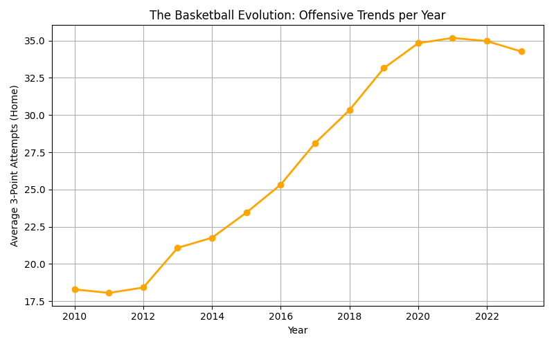
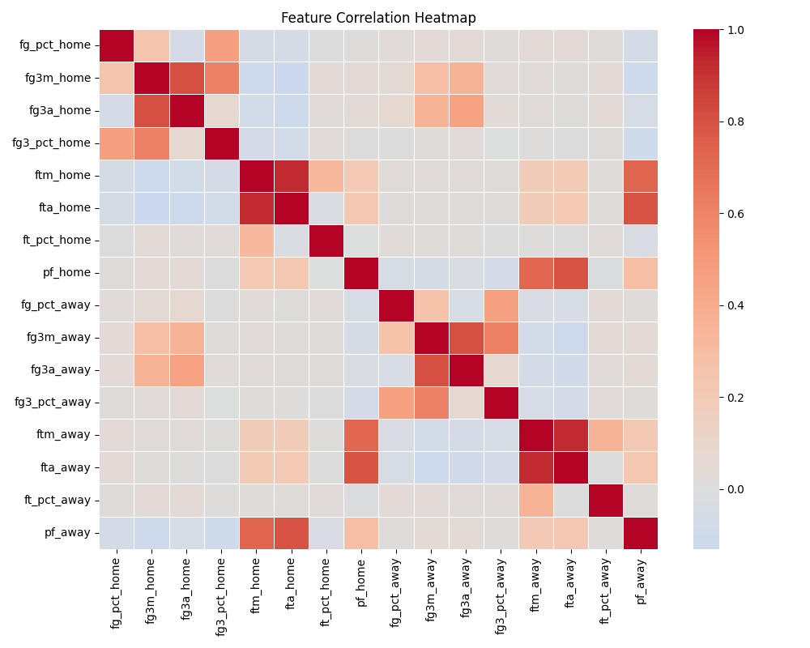
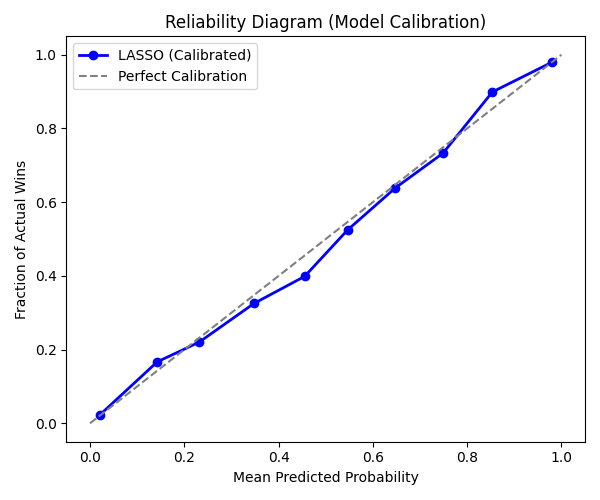
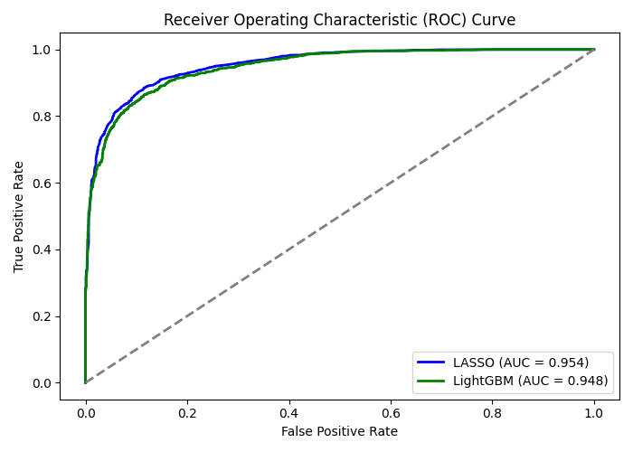
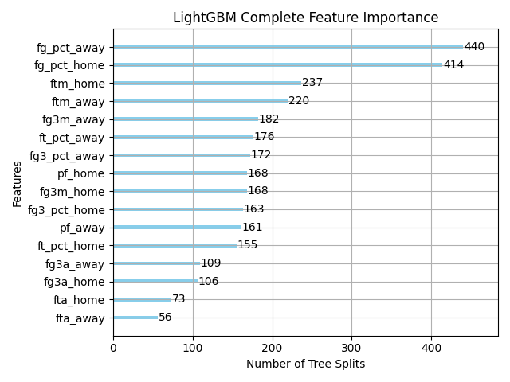

# Courtside Inference: Probabilistic Classifiers for NBA Games 🏀

**Boston University | ENG EC503: Learning From Data** *Contributors: Bharath Srividhya, Hanks Lin, Jeffery Sheu*

## Project Overview
Predicting the outcome of NBA games is a notoriously complex task due to high-dimensional data and the inherent noise of human athletic performance. Rather than focusing solely on rigid binary classification accuracy, this project develops a machine learning pipeline to output **calibrated probabilities** (Log-Loss optimization) to properly assess model confidence. 

We compare a heavily regularized traditional linear model (L1 Logistic Regression / LASSO) against a modern non-linear tree ensemble (LightGBM).

## Key Findings
* **Baseline Victory:** The L1 regularized Logistic Regression baseline outperformed the LightGBM ensemble. In highly noisy, tabular sports data, LASSO's aggressive feature selection effectively dropped irrelevant metrics, whereas untuned complex ensembles slightly overfit the noise.
* **Accuracy:** LASSO (87.93%) vs. LightGBM (87.00%)
* **Log-Loss:** LASSO (0.2764) vs. LightGBM (0.2901)
* **The Drivers:** The models discarded volume statistics (like total assists), proving mathematically that shooting efficiency and guaranteed points are the ultimate drivers of game outcomes.

## Project Structure
* `sql_helper.py`: Connects to the local SQLite database and extracts historical game data.
* `data_preprocessing.py`: Cleans raw game data, filters out exhibition games, and handles redundancies.
* `feature_engineering.py`: Constructs time-series features (rolling averages), calculates fatigue metrics (back-to-backs), and applies per-season Z-score normalization to account for the evolution of the modern NBA.
* `model_training.py`: Handles chronological train/test splitting, probability calibration (Isotonic Regression), model evaluation, and graph generation.
* `make_graph.py`: A standalone utility script to visualize offensive trends over time directly from the database.

## Installation & Usage

1. **Clone the repository and enter the directory:**
    git clone https://github.com/YOUR_USERNAME/NBA_Predictions.git
    cd NBA_Predictions

2. **Activate your virtual environment and install dependencies:**
    source venv/bin/activate
    pip install -r requirements.txt

3. **Run the full ML Pipeline:**
    python main.py

*This will train the models, output performance metrics to the terminal, save the deployed models as `.pkl` files, and generate the analytical graphs.*

## Visual Results & Analysis

### 1. Era Normalization
Basketball has evolved rapidly. A team taking thirty 3-pointers in 2010 was an anomaly; today, it is below the league average. We implemented per-season temporal normalization to scale features relative to their specific era.

### 2. Feature Collinearity
NBA statistics are heavily correlated. This heatmap numerically justifies the use of an L1 (LASSO) penalty to shrink redundant coefficients to exactly zero.

### 3. Model Calibration
To prevent the models from outputting overconfident predictions, we utilized Isotonic Regression. The reliability diagram below demonstrates how the model probabilities align closely with the perfect diagonal.

### 4. Classification Separation Power
The ROC curve comparison visually demonstrates the similar separation power of both models, with the L1 regularized linear approach maintaining a slight Area Under the Curve (AUC) advantage.

### 5. Ensemble Feature Importance
The LightGBM model recursively evaluated the engineered dimensions. It prioritized opponent efficiency and home-court free throws over volume-based statistics.

